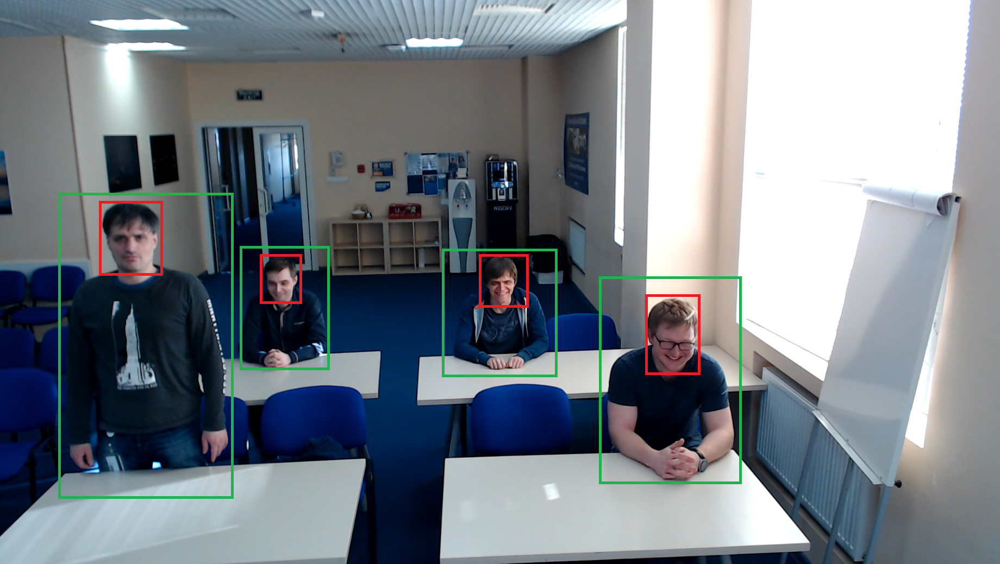

# face-person-detection-retail-0002

## Use Case and High-Level Description

This is a face and person detector for Retail scenario. It is based on
MobileNetV2-like backbone that includes depth-wise convolutions to reduce the amount of
computation for the 3x3 convolution block. The two SSD heads from 1/8 (for face detection)
and 1/16 (for person detection) scale feature maps has 9 clustered prior boxes.

## Example

## Specification

| Metric                          | Value                                     |
|---------------------------------|-------------------------------------------|
| AP for persons                  | 88.12%                                    |
| AP (WIDER) for faces            | 83.59% (>64px), 87.55% (>100px)           |
| Pose coverage                   | Standing upright, parallel to image plane |
| Support of occluded persons     | YES                                       |
| Occlusion coverage              | <50%                                      |
| GFlops                          | 2.8                                       |
| MParams                         | 0.8                                       |
| Source framework                | Caffe*                                    |

Average Precision (AP) is defined as an area under
the [precision/recall](https://en.wikipedia.org/wiki/Precision_and_recall)
curve.

## Inputs

1. name: "input" , shape: [1x3x320x544] - An input image in the format [BxCxHxW],
   where:
    - B - batch size
    - C - number of channels
    - H - image height
    - W - image width

   Expected color order is BGR.

## Outputs

1. The net outputs blob with shape: [1, 1, N, 7], where N is the number of detected
   bounding boxes. For each detection, the description has the format:
   [`image_id`, `label`, `conf`, `x_min`, `y_min`, `x_max`, `y_max`]
    - `image_id` - ID of the image in the batch
    - `label` - predicted class ID
    - `conf` - confidence for the predicted class
    - (`x_min`, `y_min`) - coordinates of the top left bounding box corner
    - (`x_max`, `y_max`) - coordinates of the bottom right bounding box corner.

## Legal Information
[*] Other names and brands may be claimed as the property of others.
