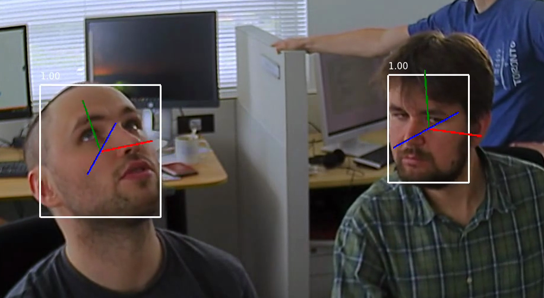

# head-pose-estimation-adas-0001

## Use Case and High-Level Description

Head pose estimation network based on trimmed SqueezeNet_v1.1. Angle regression
layers are convolutions (width: 128) + ReLU + batch norm + fully connected with
one output.

## Validation Dataset

[Biwi Kinect Head Pose Database](https://data.vision.ee.ethz.ch/cvl/gfanelli/head_pose/head_forest.html)

## Example

## Specification

| Metric                | Value                                       |
|-----------------------|---------------------------------------------|
| Min face size         | 60x60 pixels (fixed)                        |
| Supported ranges      | YAW [-90,90], PITCH [-70,70], ROLL [-70,70] |
| GFlops                | 0.1                                         |
| MParams               | 1.9                                         |
| Source framework      | Caffe*                                      |

## Accuracy

| Angle |  [Mean](https://en.wikipedia.org/wiki/Mean_absolute_error) ± [standard deviation](https://en.wikipedia.org/wiki/Standard_deviation) of absolute error |
|-------|-------------------------------------------------------------------------------------------------------------------------------------------------------|
| yaw   |  5.4 ± 4.4                                                                                                                                            |
| pitch |  5.5 ± 5.3                                                                                                                                            |
| roll  |  4.6 ± 5.6                                                                                                                                            |

## Inputs

Image in BGR format with size 60x60.

## Outputs

Output layer names in Inference Engine format:

- `angle_y_fc`
- `angle_p_fc`
- `angle_r_fc`

Output layer names in Caffe* format:

- `fc_y`
- `fc_p`
- `fc_r`

Each output contains one float value that represents value in Tait-Bryan angles
(yaw, pitсh or roll).

## Legal Information
[*] Other names and brands may be claimed as the property of others.
