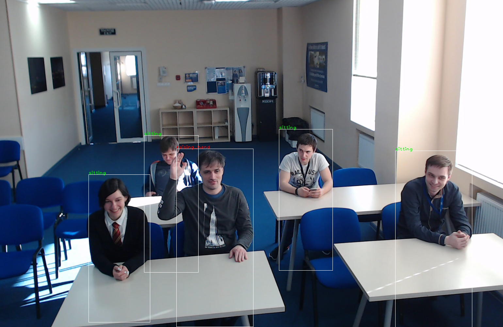

# person-detection-action-recognition-classroom-0001

## Use Case and High-Level Description

This is an action detector for the Smart Classroom scenario. It is based on the RMNet backbone that includes depth-wise convolutions to reduce the amount of computations for the 3x3 convolution block. The first SSD head from 1/16 scale feature map has four clustered prior boxes and outputs detected persons (two class detector). The second SSD-based head predicts actions of the detected persons. Possible actions: sitting, standing, raising hand.

## Example

## Specification

| Metric                          | Value                                     |
|---------------------------------|-------------------------------------------|
| Detector AP (internal test set) | 95.20%                                    |
| Accuracy (internal test set)    | 86.47%                                    |
| Pose coverage                   | Sitting, standing, raising hand           |
| Support of occluded pedestrians | YES                                       |
| Occlusion coverage              | <50%                                      |
| Min pedestrian height           | 80 pixels (on 1080p)                      |
| GFlops                          | 3.4                                       |
| MParams                         | 1.2                                       |
| Source framework                | Caffe*                                    |

Average Precision (AP) is defined as an area under the [precision/recall](https://en.wikipedia.org/wiki/Precision_and_recall)
curve.

## Inputs

1. name: "input" , shape: [1x3x320x544] - An input image in the format [BxCxHxW],
   where:
    - B - batch size
    - C - number of channels
    - H - image height
    - W - image width

   Expected color order is BGR.

## Outputs

The net outputs four branches:

1. name: `mbox_loc1/out/conv/flat`, shape: [b, num_priors*4] - Box coordinates in SSD format
2. name: `mbox_main_conf/out/conv/flat/softmax/flat`, shape: [b, num_priors*2] - Detection confidences
3. name: `mbox_add_conf/out/conv/flat/argmax/flat`, shape: [b, num_priors*3] - Action confidences
4. name: `mbox/priorbox`, shape: [1, 2, num_priors*4] - Prior boxes in SSD format

Where:
    - b - batch size
    - num_priors -  number of priors in SSD format (equal to 20x34x4=2720)

## Legal Information
[*] Other names and brands may be claimed as the property of others.
